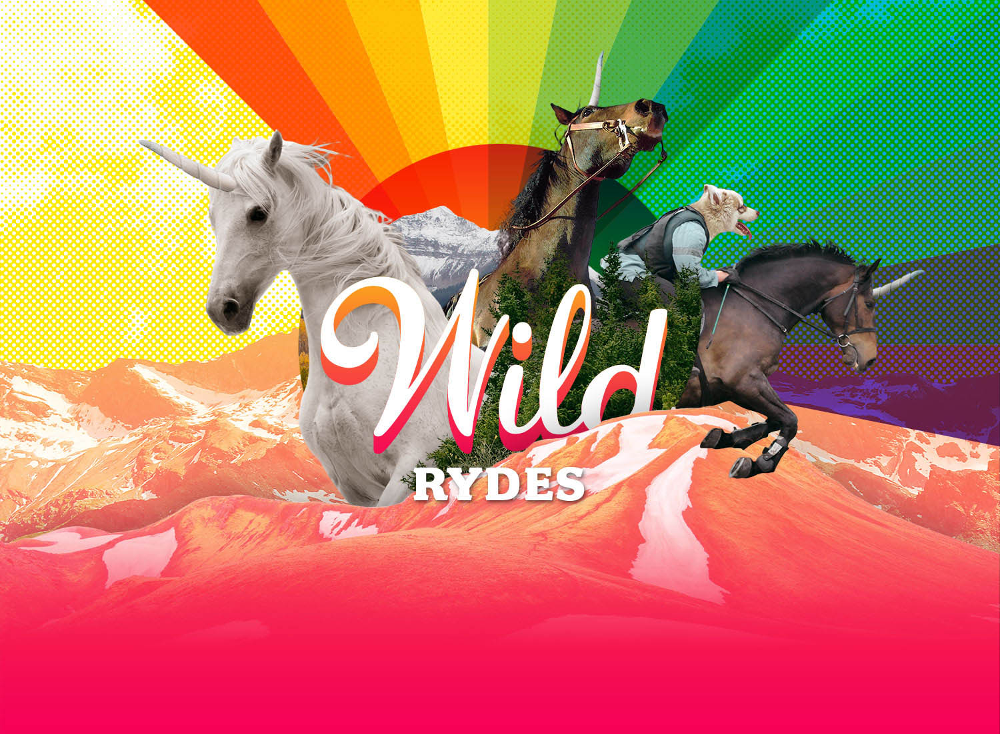

<!SLIDE noprint>
# Welcome!

~~~SECTION:notes~~~
In this scenario, we’re building a marketing site for Wild Rydes, which is a fictional transportation startup that allows you to hail a unicorn from anywhere in the world.  

Wild Rydes was started by a former hedge fund analyst and a software developer. The two long-time friends happened upon the Wild Rydes idea after attending a silent yoga retreat in Nevada. They saw an opportunity to marry society’s demand for faster, more flexible transportation to underutilized magical creatures through an on-demand transportation network app. Using the founders’ respective expertise in animal husbandry and software engineering, Wild Rydes was formed!
~~~ENDSECTION~~~
