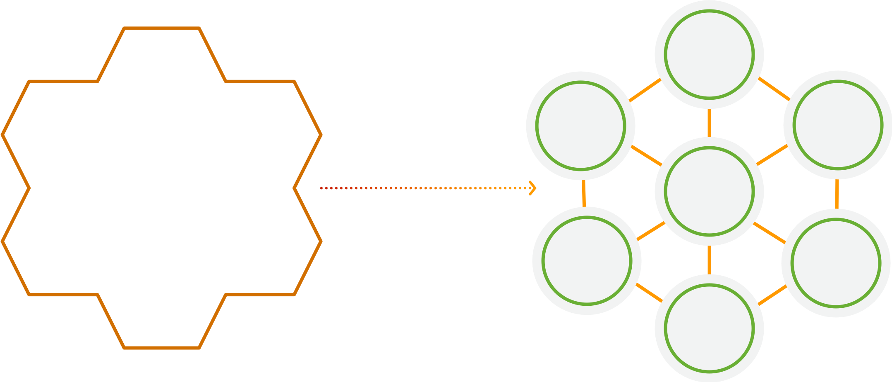

<!SLIDE >
## __Microservices__ allow you to decompose for __agility__

 

~~~SECTION:notes~~~
What microservices are

“…the microservice architectural style is an approach to developing a single application as a suite of small services, each running in its own process and communicating with lightweight mechanisms, often an HTTP resource API…” (Martin Fowler)

What microservices are not

* Defined by the number of lines of code
* Services that only have subroutines (calculation or a validation) are functions, not a service
* Services that only expose CRUD operations are remote procedure call (RPC) to a database, not a service
* REST / SOAP provide common interfaces for integration but don’t change the logical responsivity of the implementation

From monolith to microservices

Advantages:

* Innovation: The fact that small teams can act autonomously and choose the appropriate technologies, frameworks, and tools for their domains is an important driver for innovation. Responsibility and accountability foster a culture of ownership for services.
* Quality: Organizing software engineering around microservices can also improve the quality of code. The benefits of dividing software into small and well-defined modules are similar to those of object-oriented software engineering: improved reusability, composability, and maintainability of code.
* Scalability: Fine-grained decoupling of microservices is a best practice for building large- scale systems. It’s a prerequisite for performance optimization since it allows choosing the appropriate and optimal technologies for a specific service.
* Availability: Microservices architectures make it easier to implement failure isolation. 

~~~ENDSECTION~~~
