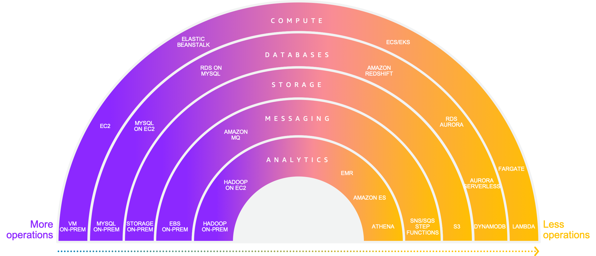

<!SLIDE >
## Serverless is an __operational construct__

  

~~~SECTION:notes~~~

You have heard us talk about shared responsibility in the past.  Simply stated, a shared responsibility model implies there are parts of the system that AWS is responsible for and there are parts of the systems that you as a customer must take responsibility for. In many cases we provide tools and there is a rich ecosystem of open source and commercial products that makes it easier for all of you to own your side of the responsibility box.

There is no one hard line on where this line is drawn between the two parts of shared responisbility.  One one side of the spectrum you can leverage the power and flexibility of EC2 to run your own database.  You can use something like RDS to simplify the management of the database or use RDS Aurora to completely offload the database storage infrastructure to an AWS managed backend.  Alternatively you can move to a fully managed database like DynamoDB where you create tables, put data in those tables, and query the data.  There is no infrastructure to manage.  QoS is part of the the database service with sufficient knobs and dials to give you the right level of control.

The question we keep asking ourselves is: how can we draw this line in a way that allows our customers to innovate on business problems, but makes the underlying infrastructure less visible.  Any time you spend coraling infrastructure is undifferentiated heavy lifting.  Over the last 12 years as more and more people start in the cloud or move major applications to the cloud, this definition of "undifferentiated havy lifting has evolved"

~~~ENDSECTION~~~
