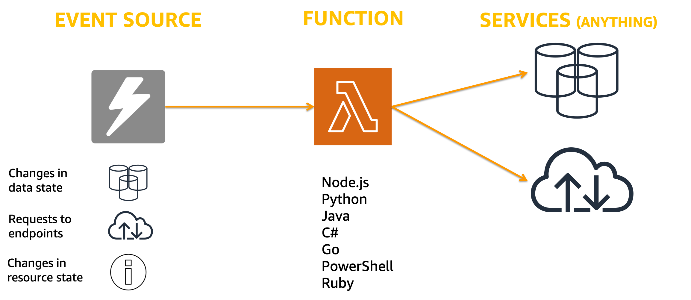

<!SLIDE >
## Serverless compute

 

~~~SECTION:notes~~~

The model of compute is simple: you have an event coming from an AWS service or an invocation, a request coming from an endpoint or a change on a resource and your code gets executed.
T
his code can be built with virtually any kind of language. We, out of the box, support and manage these ones but you can build you custom runtime.

From this code, do what your business need! Connect to services, public endpoints, calculations, DBs, transformation. Basically, code.

15 mins execution limit

Event driven

~~~ENDSECTION~~~
