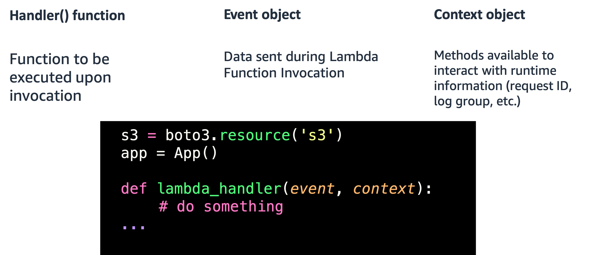

<!SLIDE >
## Anatomy of a Lambda function

 

~~~SECTION:notes~~~

Event object: The event that triggered this code. For example, the content of an API request, the item of an SQS queue item, the location of a file on S3.

The context gives you information about the actual execution of the lambda.

~~~ENDSECTION~~~
