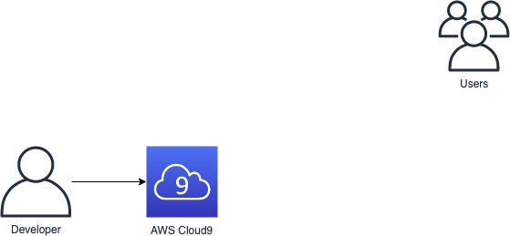

<!SLIDE >
# Module 0: Set up AWS Cloud9

~~~SECTION:notes~~~
Integrated Development Environment (IDE) in a browser

Code hints, code completion, and step-through debugging

Remotely pair program in real time

Prepackaged tools for over 40 programming languages

Direct terminal access
~~~ENDSECTION~~~
