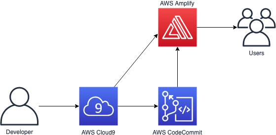

<!SLIDE >
# Module 1: Static web hosting

~~~SECTION:notes~~~
Fully-managed source control service; Git-based repositories

Collaborate using branching, pull requests, etc

Amplify -

Supports GraphQL or REST API backends

Supports Single Page Application (SPA) frameworks
~~~ENDSECTION~~~
