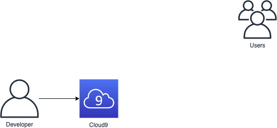

<!SLIDE >
# Module 0: Set up AWS Cloud9

Features:

* Integrated Development Environment (IDE) in a browser
* Code hints, code completion, and step-through debugging
* Remotely pair program in real time
* Prepackaged tools for over 40 programming languages
  * Git, AWS CLI, Node.js, JavaScript, Python, PHP, Ruby, Go, C++, etc
* Direct terminal access

[Link to module 0](https://github.com/aws-samples/aws-serverless-workshops/tree/master/WebApplication/0_Setup)
